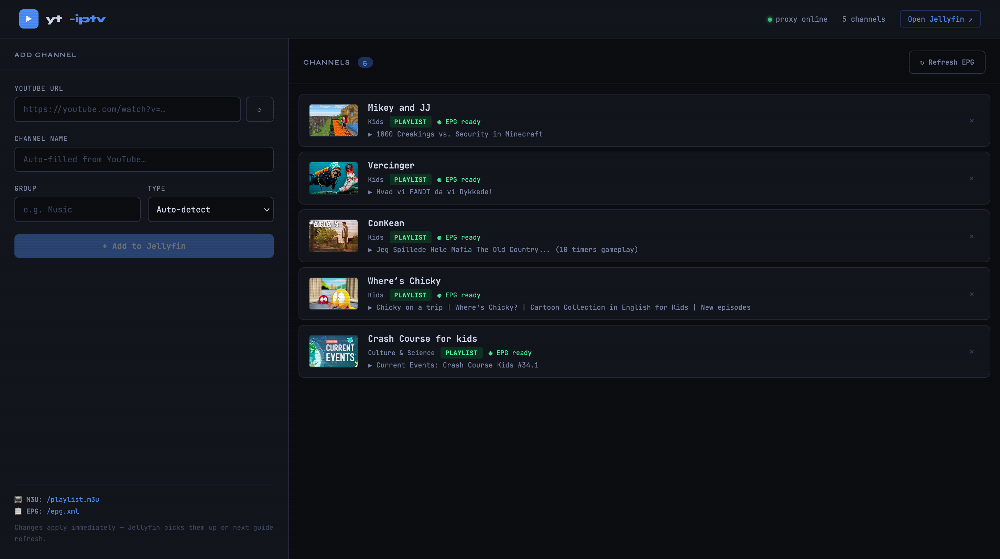
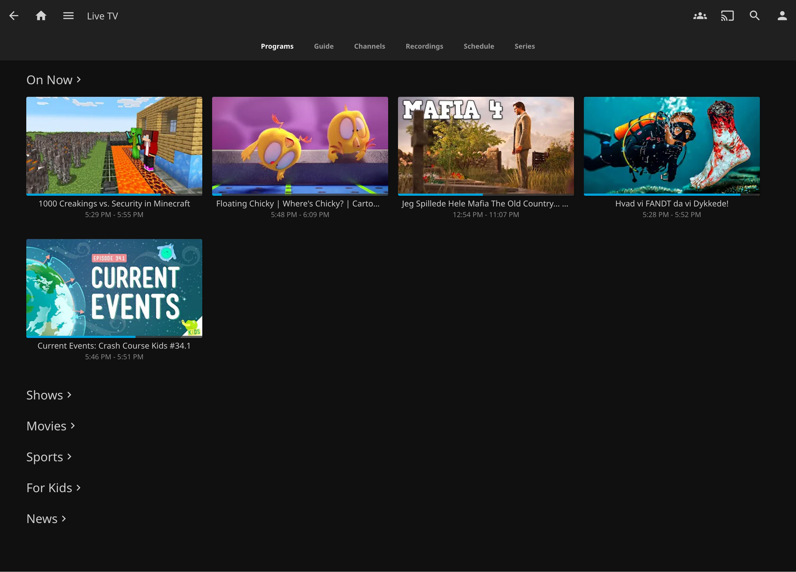
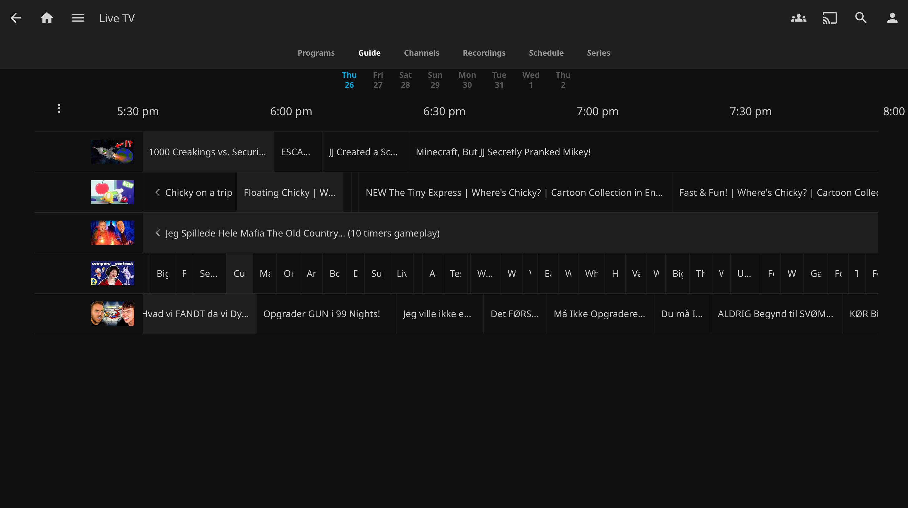
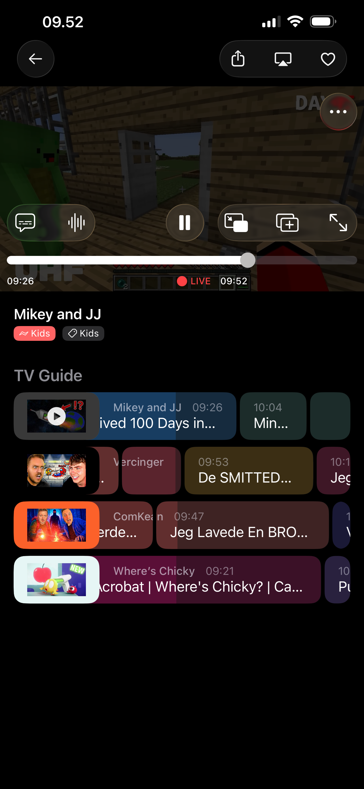

# yt-iptv

Turn any YouTube channel into a live TV channel — with a real EPG guide, 1080p playback, and automatic daily scheduling. Streams to **Jellyfin**, **Kodi**, **VLC**, **TiviMate**, **Infuse**, or any IPTV player that supports M3U + XMLTV.

Runs on a **Raspberry Pi 4** (or any Linux machine with Docker).

> 🤖 **Vibe-coded** — every line of this project was written through AI-assisted pair programming with [Claude](https://claude.ai).

---

## Screenshots

| Channel Manager | Jellyfin — On Now |
|---|---|
|  |  |

| Jellyfin — TV Guide | Mobile |
|---|---|
|  |  |

---

## How it works

- Paste a YouTube channel URL into the web UI
- The app fetches **up to 200 videos** with full metadata (title, duration, thumbnail)
- A **fresh daily schedule** is generated at midnight — random order each day, loops when all videos have played
- The schedule is exposed as a standard **XMLTV EPG** so your player shows titles, times, and thumbnails — exactly like real TV
- When you tune in, it streams the video scheduled for **right now**, seeking to the correct position (tune in 10 minutes late and you join 10 minutes in)
- When a video ends, the **next scheduled one starts automatically** — no gaps, no manual intervention
- Stream URLs are **pre-resolved in the background** so playback starts fast

---

## Requirements

- Raspberry Pi 4 — or any Linux machine
- Docker + Docker Compose

---

## Quick start

### 1. Install Docker (skip if already installed)

```bash
curl -fsSL https://get.docker.com | sh
sudo usermod -aG docker $USER && newgrp docker
sudo systemctl enable docker
```

### 2. Clone the repo

```bash
git clone https://github.com/boterocamilo/yt-iptv-rpi.git
cd yt-iptv-rpi
```

### 3. Configure your IP

```bash
cp .env.example .env
nano .env   # set RPI_IP to your machine's local IP, e.g. 192.168.1.100
```

### 4. Launch

```bash
docker compose up -d --build
```

The first build downloads ffmpeg and yt-dlp — allow ~5 minutes on a Pi.

---

## Access

| Service | URL |
|---|---|
| Channel Manager | `http://<RPI_IP>:5000` |
| Jellyfin | `http://<RPI_IP>:8096` |

---

## Adding channels

1. Open the **Channel Manager** at `http://<RPI_IP>:5000`
2. Paste a YouTube channel URL, e.g. `https://www.youtube.com/@SomeChannel/videos`
3. Fill in a name and group (optional — used to organise channels in your player)
4. Click **+ Add to Jellyfin**
5. The app fetches up to 200 videos and builds the schedule — takes 1–3 minutes
6. Refresh the guide in your IPTV player to see the new channel

---

## IPTV player setup

This project exposes standard M3U and XMLTV endpoints that work with **any IPTV player**:

| Endpoint | URL |
|---|---|
| M3U Playlist | `http://<RPI_IP>:5000/playlist.m3u` |
| XMLTV EPG | `http://<RPI_IP>:5000/epg.xml` |

Compatible players: **Jellyfin**, **Emby**, **Plex**, **Kodi**, **VLC**, **Infuse**, **TiviMate**, **OTT Navigator**, **IPTV Smarters**, and any other app that accepts M3U + XMLTV.

### Jellyfin setup

1. Open Jellyfin at `http://<RPI_IP>:8096` and complete the setup wizard
2. Go to **Dashboard → Live TV**
3. Add a **Tuner Device** → type **M3U Tuner** → URL: `http://<RPI_IP>:5000/playlist.m3u`
4. Add a **TV Guide Data Provider** → type **XMLTV** → URL: `http://<RPI_IP>:5000/epg.xml`
5. Go to **Dashboard → Live TV → Guide** → click **Refresh Guide Data**
6. Open **Live TV** — channels appear with full programme guide

---

## Architecture

```
IPTV player (Jellyfin, Kodi, VLC, etc.)
    │
    ├── GET /playlist.m3u   → list of channels
    ├── GET /epg.xml        → XMLTV programme guide (built from daily schedule)
    └── GET /stream/<id>    → continuous mpegts stream
                                  │
                                  ├── finds the currently scheduled video
                                  ├── seeks to the correct time offset
                                  ├── ffmpeg merges H.264 video + AAC audio → mpegts
                                  └── when video ends → next scheduled video starts
```

### Key files

| File | Purpose |
|---|---|
| `yt-iptv/stream_proxy.py` | Flask app — scheduling, streaming, EPG, API |
| `yt-iptv/ui/index.html` | Channel Manager web UI |
| `yt-iptv/Dockerfile` | Container (Python 3.11 + ffmpeg + yt-dlp) |
| `docker-compose.yml` | Orchestrates yt-iptv + Jellyfin |

---

## Configuration

All config is at the top of `stream_proxy.py`:

| Variable | Default | Description |
|---|---|---|
| `PLAYLIST_MAX_ENTRIES` | `200` | Max videos fetched per channel |
| `EPG_REFRESH_INTERVAL` | `3600` | Seconds between full EPG refreshes |
| `SURL_TTL` | `14400` | Stream URL cache TTL (4 hours) |

---

## Updating yt-dlp

YouTube changes frequently. If streams stop working, update yt-dlp inside the running container:

```bash
docker exec yt-iptv yt-dlp -U
```

---

## Troubleshooting

**Channel not playing**
```bash
docker logs yt-iptv --tail 50
```

**EPG not showing in player**
```bash
curl http://<RPI_IP>:5000/epg/refresh
```
Then refresh the guide in your IPTV player.

**Check schedule and cache status**
```bash
curl http://<RPI_IP>:5000/health | python3 -m json.tool
```

---

## Limitations

- YouTube CDN URLs expire after ~4 hours — the app refreshes them automatically in the background
- 1080p requires H.264 (avc1) to be available for the video; falls back to 720p if not
- Some YouTube channels restrict access and may return no results

---

## License

MIT
